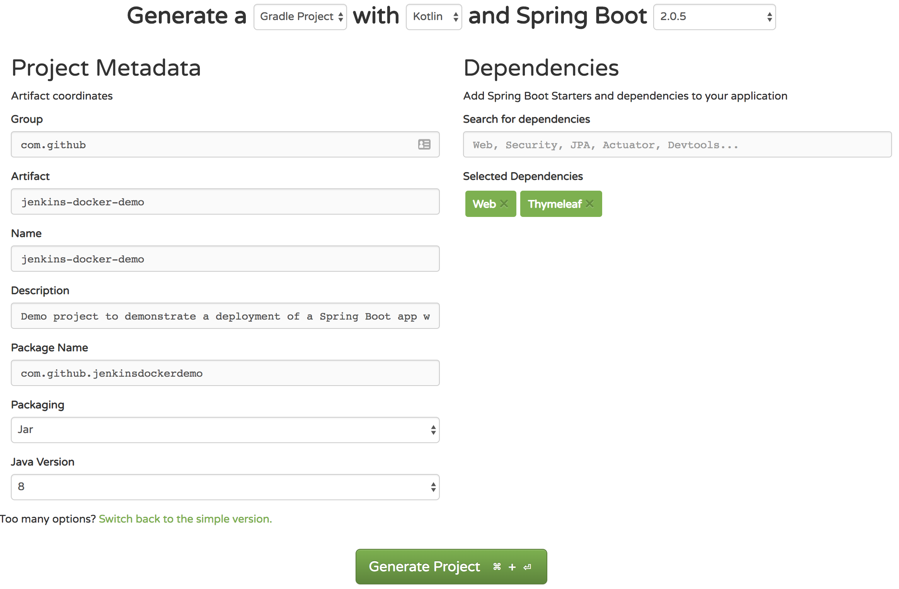
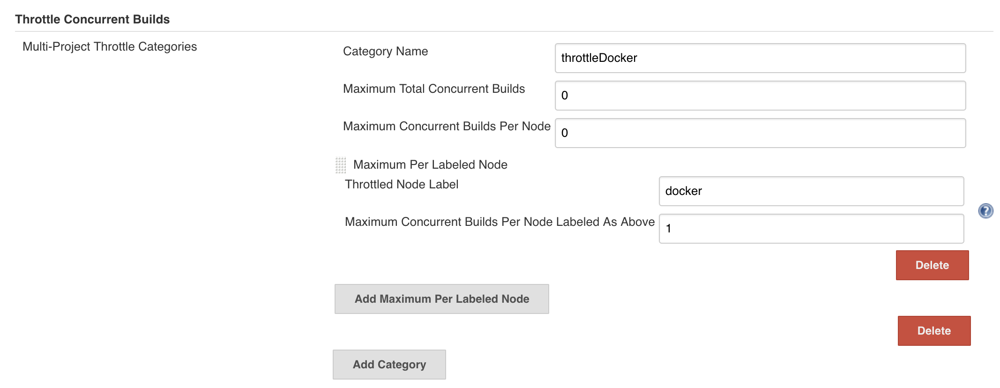

Setting up Jenkins with Blue Ocean to work with Docker took quite some time, while in reality it doesn't have to. I found an awesome video on YouTube by [Boxboat Technologies](https://youtu.be/GkGXAPj8wSI) that helped me out for the initial setup. 
In this post I'll use Jenkins Blue Ocean to create a Docker container with a simple Spring Boot app, run some tests and deploy the app to a server.

This will take a couple of steps: 
1. Create a simple Spring Boot app
    1. Use start.spring.io to generate the bootstrap app
    1. Create a very simple page
    1. Create a very simple unit test just to prove we can run tests
    1. Push the code to Github
1. Prepare the server(s) with Jenkins Blue Ocean
    1. Create a Jenkins master
    1. Create a Jenkins build agent
1. Prepare a server to host our app
1. Setup Jenkins to deploy our app
1. Deploy the app and enjoy the result

# First step: Create a simple Spring Boot app
Since there are a lot of very good tutorials on the web describing the creation of Spring Boot applications I won't spend too much time on that here.

## Generate Spring boot app
First we'll go to [start.spring.io](https://start.spring.io/) and generate a bootstrap project. Here's my setup:



Download the project, unpack the zip file and open the project in your favorite IDE or text editor. I'll use IntelliJ.
 
As I said, this will be a very simple Spring Boot app, and I will use Kotlin and Gradle. I personally prefer to use Kotlin Gradle DSL, but since this is mainly about deployment, I'll just stick to the defaults.

I used a simple [Bootstrap](http://getbootstrap.com/) template named [Freelancer](https://startbootstrap.com/template-overviews/freelancer/) and used [Thymeleaf](https://www.thymeleaf.org/) to serve the page on Spring Boot. 

The project I use for this demo can be found on [Github](https://github.com/johanvergeer/jenkins-docker-demo)

# Setup Jenkins with Blue Ocean
I'll use [DigitalOcean](https://m.do.co/c/bb3d4e750ffb) for hosting. As a software developer I found this very easy to setup and maintain servers.

## Setup Jenkins Master
First step is to install a Jenkins Master. We'll use Docker to run Jenkins on the server.

```bash
# Install Docker
curl -sSL https://get.docker.com/ | sh
# Add user to Docker group... 
sudo usermod -aG docker $(whoami)
# ...and switch to the new group
newgrp docker
```

Run the Jenkins container and tail the logs

```bash
mkdir ~/jenkins
cd ~/jenkins
docker run -d --name jenkins -p 8080:8080 -p 50000:50000 -v $(pwd):/var/jenkins_home --restart always jenkins/jenkins:lts
docker logs -f jenkins
```

Open the Jenkins web ui at `http://yourhostname:8080` and install the following plugins

> The Jenkins admin password was shown when Jenkins was started in your console

- [Blue Ocean](https://jenkins.io/projects/blueocean/) is just for the Blue Ocean UI
- [AnsiColor](https://github.com/jenkinsci/ansicolor-plugin)
- [Self-Organizing Swarm Plug-in Modules](https://wiki.jenkins.io/display/JENKINS/Swarm+Plugin) to let the Jenkins agent connect to the Jenkins master
- [Throttle Concurrent Builds Plug-in](https://github.com/jenkinsci/throttle-concurrent-builds-plugin) to restrict the amount of jobs that will run in parallel on our build agent

After installing confirm the plugins have moved from the "Available" to the "Installed" page. This will also have installed other dependencies that are required by the plugins.

## Setup a Jenkins Agent
Once we have a Jenkins Master, we can setup a Jenkins agent we'll use to run our builds on. Here we'll also use Docker so let's install it first

```bash
# Install Docker
curl -sSL https://get.docker.com/ | sh
# Add user to Docker group... 
sudo usermod -aG docker $(whoami)
# ...and switch to the new group
newgrp docker
```

### Jenkins Swarm module
The Jenkins Swarm module comes with a cli agent, which connects the Jenkins agent to the Jenkins master. 
First we'll need Java 8 to let us run the Jenkins swarm cli agent, which is a Java client on the Jenkins agent

```bash
sudo apt install openjdk-8-jdk
```

Next download the Jenkins Swarm client
```bash
sudo -s
mkdir -p /usr/local/jenkins
cd /usr/local/jenkins
wget https://repo.jenkins-ci.org/releases/org/jenkins-ci/plugins/swarm-client/3.7/swarm-client-3.7.jar # Make sure you're using the correct version!
touch swarm.sh
chmod +x swarm.sh
```

Create a shell script that executes the Jenkins Swarm client
```bash
# This should go into /usr/local/jenkins/swarm.sh

#!/bin/bash
cd $(dirname $0)

JENKINS_IP="10.0.0.1"
USERNAME="admin"
PASSWORD="12345678"

# $(hostname) will be the name that appears in Jenkins UI
# -executors is the number of concurrent tasks that it can handle from Jenkins
# -labels is the name of the node
# -master is the ip addess of the Jenkins Master
java -jar swarm-client-3.7.jar -name "$(hostname)" -executors 8 -labels docker -master "http://$JENKINS_IP:8080" -username "$USERNAME" -password "$PASSWORD" -fsroot /tmp
```

#### Confirm the Swarm client is working

Now when you run the script we just created you should see something like the following output which confirms we can connect to the Jenkins master

```bash
me@jenkins-agent-1:/usr/local/jenkins$ ./swarm.sh
Sep 28, 2018 8:22:44 AM hudson.plugins.swarm.Client main
INFO: Client.main invoked with: [-name jenkins-agent-1 -executors 8 -labels docker -master http://$jenkins_master_ip:8080 -username $username -password $password -fsroot /tmp]
Sep 28, 2018 8:22:45 AM hudson.plugins.swarm.Client run
INFO: Discovering Jenkins master
SLF4J: Failed to load class "org.slf4j.impl.StaticLoggerBinder".
SLF4J: Defaulting to no-operation (NOP) logger implementation
SLF4J: See http://www.slf4j.org/codes.html#StaticLoggerBinder for further details.
Sep 28, 2018 8:22:45 AM hudson.plugins.swarm.Client run
INFO: Attempting to connect to http://$jenkins_master_ip:8080/ secret with ID anid
Sep 28, 2018 8:22:46 AM hudson.remoting.jnlp.Main createEngine
INFO: Setting up agent: jenkins-agent-1-5cbaa68d
Sep 28, 2018 8:22:46 AM hudson.remoting.jnlp.Main$CuiListener <init>
INFO: Jenkins agent is running in headless mode.
Sep 28, 2018 8:22:46 AM hudson.remoting.Engine startEngine
WARNING: No Working Directory. Using the legacy JAR Cache location: /home/me/.jenkins/cache/jars
Sep 28, 2018 8:22:46 AM hudson.remoting.jnlp.Main$CuiListener status
INFO: Locating server among [http://ip_address:8080/]
Sep 28, 2018 8:22:46 AM org.jenkinsci.remoting.engine.JnlpAgentEndpointResolver resolve
INFO: Remoting server accepts the following protocols: [JNLP4-connect, Ping]
Sep 28, 2018 8:22:46 AM hudson.remoting.jnlp.Main$CuiListener status
INFO: Agent discovery successful
  Agent address: jenkins_agent_address
  Agent port:    50000
  Identity:      secret
Sep 28, 2018 8:22:46 AM hudson.remoting.jnlp.Main$CuiListener status
INFO: Handshaking
Sep 28, 2018 8:22:46 AM hudson.remoting.jnlp.Main$CuiListener status
INFO: Connecting to 188.166.10.76:50000
Sep 28, 2018 8:22:46 AM hudson.remoting.jnlp.Main$CuiListener status
INFO: Trying protocol: JNLP4-connect
Sep 28, 2018 8:22:47 AM hudson.remoting.jnlp.Main$CuiListener status
INFO: Remote identity confirmed: secret
Sep 28, 2018 8:22:48 AM hudson.remoting.jnlp.Main$CuiListener status
INFO: Connected
```

And in the Jenkins UI you should see something like this in the botton left corner

{:height="100px" width="100px"}


#### Create a service to start `swarm.sh`

Edit the file `/etc/systemd/system/jenkins.service` so that it contains the following:
```bash
[Unit]
Description=Jenkins
After=network.target

[Service]
User=$(whoami) # Replace this with a valid username
Restart=always
Type=simple
ExecStart=/usr/local/jenkins/swarm.sh

[Install]
WantedBy=multi-user.target
```

Start the Jenkins service:
```bash
systemctl enable jenkins
systemctl start jenkins
```

Now each time the agent starts it will  connect to Jenkins master and is ready to receive build commands. 

# Configure throttle concurrent builds plugin

First go to *Manage Jenkins > Configure system > Throttle Concurrent Builds*



- Notice the *Throttled Name Label* value `docker`. This is the same value we used in *swarm.sh* on the agent for the `-label` argument. 
- A value to keep in mind for now is *Category Name* with value `throttleDocker`, which we'll use in the **Jenkinsfile** later.
- *Maximum Concurrent Builds Per Node Labeled As Above* indicates the maximum number of simultanious builds on the agent.

# Blue Ocean
In the Jenkins dashboard select *Open Blue Ocean*, which will open the Blue Ocean UI. Since we don't have a pipeline configured yet we can start by selecting a git repository. This is pretty straigt forward, so I won't go into detail. 

In my case there is no Jenkinsfile at the moment, so Blue Ocean will prompt me to create one. 

# Install Sonarqube
To run our static code analysis we'll use Sonarqube. We could go the long way and install everything manually, or we can choose the short way and use Docker. I prefer the short way. 
From Docker Hub:

```bash
$ docker run -d --name sonarqube -p 9000:9000 -p 9092:9092 sonarqube
```